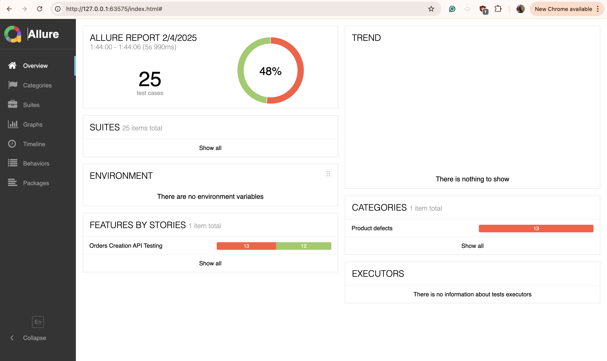
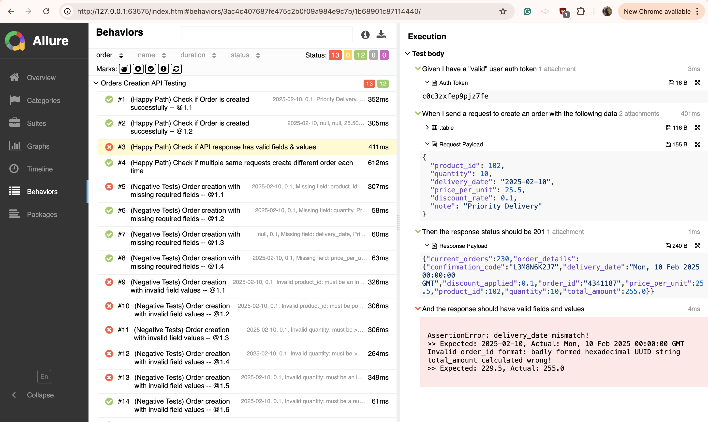

## Introduction

* The Automated Test framework aims to thoroughly test the Order Creation API.
* The framework is written in **python3** and utilises modules like **behave**, **requests**
* The Tests have been written using **BDD** (Behavior Driven Development) way as *Given, When, Then* format
* The project generates test reports in HTML and Allure ( requires local installation of allure)

### Project Structure

```
neptune_assessment
├── api
│   ├── base_api.py			# Basic http methods e.g. POST 
│   └── orders_api.py			# Orders api interactions
├── builders
│   └── order_builder.py		# Order builder class
├── features
│   ├── environment.py			# Hooks for before/after scenario
│   ├── steps
│   │   └── create_order_steps.py
│   └── test_create_orders.feature	# BDD scenarios for testing order creation
├── utils
│   └── soft_assert.py
├── behave.ini				# Report Formatter configs for behave (html, allure)
├── requirements.txt			# Python packages required for running tests
├── runner.py				# Test runner class
└── Dockerfile				# For Running tests in docker container
```

### Setup & Execution Instructions

There are two ways to run the tests:

#### 1. Running on Local Machine

**Requirements**: python3, pip3, [allure](https://allurereport.org/docs/install/) ( allure requires Java version 8+)

* [ ] Clone this repository: `git clone https://github.com/Shail06/neptune_assessment.git`
* [ ] Change Directory: `cd neptune_assessment`
* [ ] Install python packages: `pip3 install -r requirements.txt`
* [ ] Run the Tests: `python3 runner.py`  *This generates Results (HTML & ALLURE) under `test-report` directory.*
* [ ] Generate Reports: `allure serve test-report/allure-results`
  * This automatically opens allure web portal showing all the Test Results. If not, see the Link in Logs (something like *Server started at http://127.0.0.1:`<PORT>`/*)

**NOTE**: The test results are also available in plain HTML format in `report.html` but allure reports are more comprehensive.

#### 2. Running in Docker Container

All the above dependencies/packages installation on local machine (like allure, python3, pip3, java etc.) can be avoided using this method.

**Requirements:** docker

* [ ] Clone this repository: `git clone https://github.com/Shail06/neptune_assessment.git`
* [ ] Change Directory: `cd neptune_assessment`
* [ ] Build Docker Image: `docker build -t neptune_assessment .`
* [ ] Run Tests: `docker run -it -p 9090:9090 --rm neptune_assessment`
  * This will run the tests and show allure logs where you can find the link to view the report ([http://127.0.0.1:9090](http://127.0.0.1:9090))

Allure Report Screenshots:

|  |  |
| ----------------------- | ----------------------- |

### Test approach and strategy

See the [test_strategy.md](docs/test_strategy.md)

### Bug Reports

For bugs and issues found, see the [bug_reports.md](docs/bug_reports.md)

### Assumptions / Limitations

* The tests are limited to inputs based on the provided schema.
* The tests assume `total_amount` calculation for expected outcome as `total_amount = quantity * price_per_unit * (1 - discount_rate)`
* The test is limited to scope of functional, & non-functional tests but doesn't cover extreme load/stress testing of API
* The test assumes that the response time has SLA( Service Level agreement) of < 500ms.
